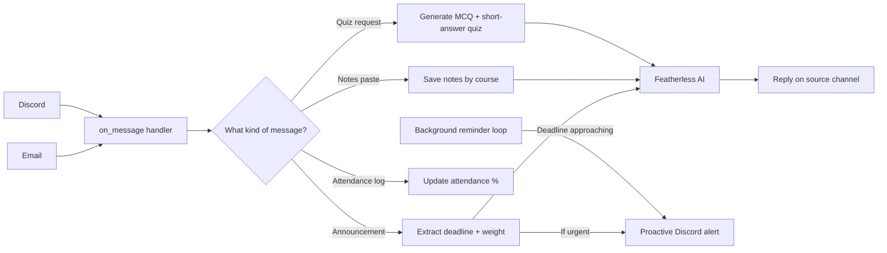

# CampusPilot AI

An autonomous university assistant that reads your emails, tracks deadlines by grade impact, generates quizzes from your notes, watches your attendance, and proactively alerts you across channels — built with [caspian-sdk](https://github.com/TryCaspian/caspian-sdk) and Featherless.ai.

Built for the 15-Day AI Agent Hackathon by Caspian.


## How it works
CampusPilot uses real tool-calling — the AI model itself decides which action to take from natural language (log a deadline, save notes, generate a quiz, track attendance) rather than matching fixed command phrases.


## Features & commands

| Feature | How to use it | What it does |
|---|---|---|
| Deadline logging | Forward/send any course email | Extracts title, due date, and grade weight; flags priority |
| Urgent alerts | *(automatic)* | If an email signals a cancellation or moved deadline, proactively pings Discord — unprompted |
| Scheduled reminders | *(automatic)* | Pings you 3 days, 1 day, and the day a deadline is due |
| Quiz generation | `NOTES: <Course Name>` then paste notes, then `quiz me on <Course Name>` | Generates 3 MCQs + 2 short-answer questions with an answer key |
| Attendance tracking | `attendance: <Course Name> present` / `absent` | Tracks running attendance %, warns before you risk exam eligibility |
| Attendance summary | `attendance status` | Shows attendance across all logged courses |
| Custom attendance threshold | `set attendance threshold: 80` or `set attendance threshold: <Course Name> 80` | Sets your own policy instead of an imposed default |

## Channels

- Email (via caspian-sdk `connect_email()`)
- Discord (via caspian-sdk `connect_discord()`)

Both run through a single `on_message` handler, as required by caspian-sdk's one-handler model.

## Tech stack

- Python
- [caspian-sdk](https://github.com/TryCaspian/caspian-sdk) — multi-channel agent identity (email + Discord)
- [Featherless.ai](https://featherless.ai) — inference (DeepSeek-V3.2)

## Setup

1. `pip install caspian-sdk python-dotenv openai`
2. Create a `.env` file:

```env
CASPIAN_API_KEY=your_key
CASPIAN_BASE_URL=https://api.trycaspianai.com
FEATHERLESS_API_KEY=your_key
DISCORD_BOT_TOKEN=your_key

3. `python agent.py`

## Known limitations

- File attachments (PDFs, images) aren't supported — notes must be pasted as text (caspian-sdk's message object doesn't currently expose attachments)
- Proactive alerts require you to have messaged the bot at least once first, so it knows which conversation to reach
- Reminder scheduling uses date precision (day-level), not exact time, since source emails rarely state an hour

## Built by

Abdullah
https://www.linkedin.com/in/abdullah-saif-138b09247/