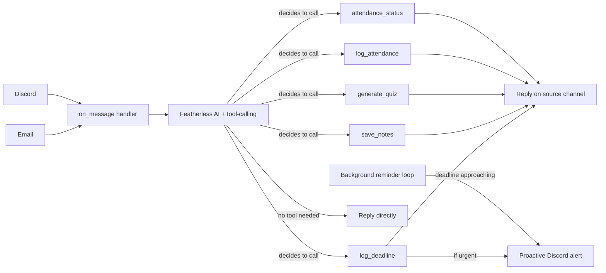

# CampusPilot AI

An autonomous university assistant that reads your emails, tracks deadlines by grade impact, generates quizzes from your notes, watches your attendance, and proactively alerts you across channels. It is built with [caspian-sdk](https://github.com/TryCaspian/caspian-sdk) and Featherless.ai.

Built for the 15-Day AI Agent Hackathon by Caspian.


## How it works
CampusPilot uses real tool-calling, the AI model itself decides which action to take from natural language (log a deadline, save notes, generate a quiz, track attendance) rather than matching fixed command phrases.


## Features

| Feature | Example | What it does |
|---|---|---|
| Deadline logging | Forward any course email, or just say *"my OOP assignment is due next Friday, worth 10%"* | Extracts title, due date, and grade weight; flags priority |
| Urgent alerts | *(automatic)* | If a message signals a cancellation or moved deadline, proactively pings Discord — unprompted |
| Scheduled reminders | *(automatic)* | Pings you 3 days, 1 day, and the day a deadline is due |
| Quiz generation | *"here's my Discrete Structures notes: [paste]"* then *"quiz me on Discrete Structures"* | Generates 3 MCQs + 2 short-answer questions with an answer key |
| Attendance tracking | *"I was in Applied Physics today"* or *"I missed OOP lab"* | Tracks running attendance %, warns before you risk exam eligibility |
| Attendance summary | *"what's my attendance looking like"* | Shows attendance across all logged courses |
| Custom attendance threshold | *"set my attendance threshold to 80%"* or *"my Physics threshold is 65%"* | Sets your own policy instead of an imposed default |

No fixed command syntax required, CampusPilot uses real tool calling, so it understands natural phrasing and picks the right action itself.

## Channels

- Email (via caspian-sdk `connect_email()`)
- Discord (via caspian-sdk `connect_discord()`)

Both run through a single `on_message` handler, as required by caspian-sdk's one-handler model.

## Tech stack

- Python
- [caspian-sdk](https://github.com/TryCaspian/caspian-sdk) — multi-channel agent identity (email + Discord)
- [Featherless.ai](https://featherless.ai) — inference (DeepSeek-V3.2)

## Setup

1. `pip install -r requirements.txt`
2. Create a `.env` file:

```env
CASPIAN_API_KEY=your_key
CASPIAN_BASE_URL=https://api.trycaspianai.com
FEATHERLESS_API_KEY=your_key
DISCORD_BOT_TOKEN=your_key

3. `python agent.py`

## Known limitations

i. File attachments (PDFs, images) aren't supported. The notes must be pasted as text (caspian-sdk's message object doesn't currently expose attachments)
ii. Proactive alerts require you to have messaged the bot at least once first, so it knows which conversation to reach
iii. Reminder scheduling uses date precision (day-level), not exact time, since source emails rarely state an hour

## Built by

Abdullah
https://www.linkedin.com/in/abdullah-saif-138b09247/
